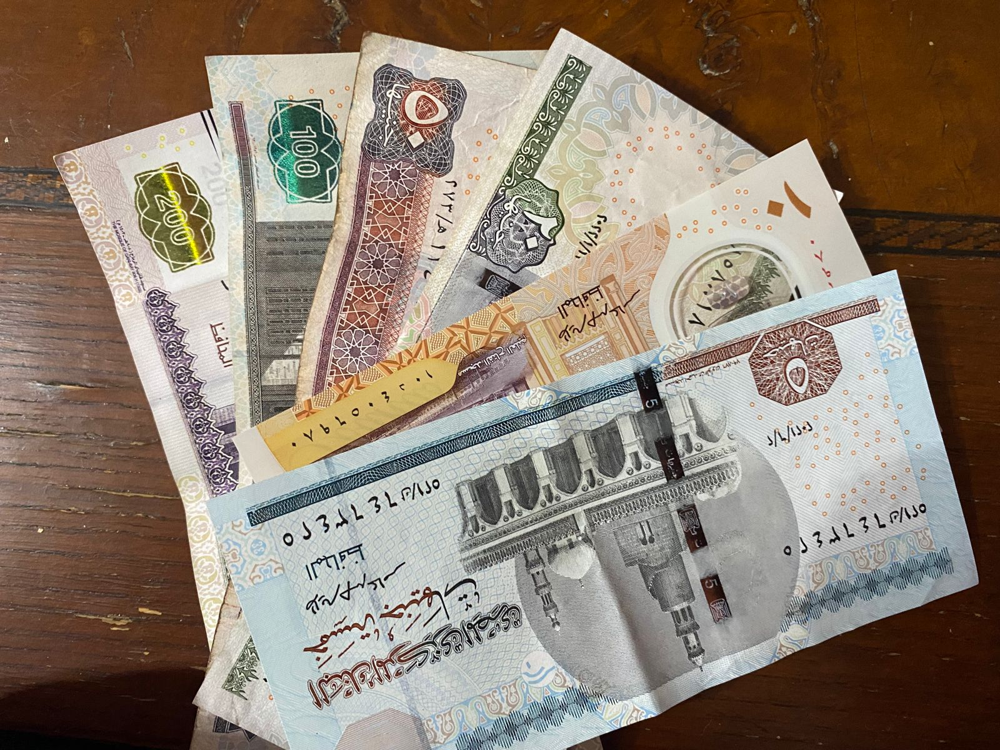

# Egyptian-Money-Classification-Using-CNN

My Deep Learning project.

Egyptian Money Classification using CNN.

A brief about the notebook:

1- Collecting Data by Camera

2- Reading Images [ From Folders ]

3- Data Augmentaion for All Classes

4- Preparing Training Images

5- Preparing Test Images

6-Building The Model (Convolutional Neural Network)

7-Model Evaulation 

8- Saving the Model

